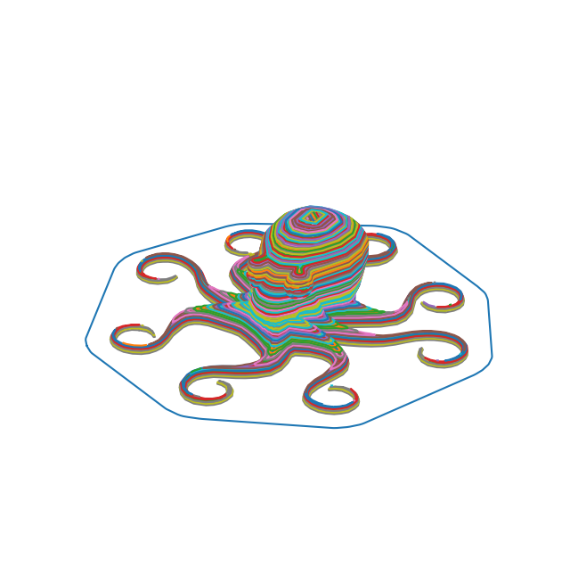
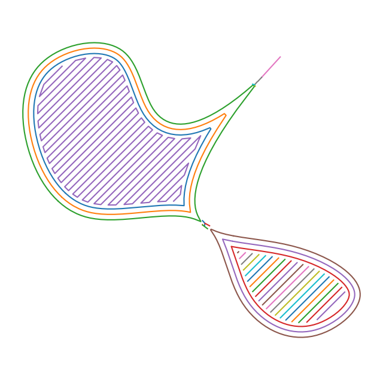

# G-code Reader
A Gcode visualization and analysis tool written in Python 3. It supports FDM G-Code, Stratasys G-Code and PBF G-Code. It can print a single layer, print multiple layers. It also can animate the printing of a single layer or multiple layers.

**Usage**

In order to use this program, you need to use -t to specify G-Code type: 1 for regular G-Code, 2 for Stratasys G-Code, 3 for PBF G-Code.

1. Plot a part in 3D. 
   

Example:
   ` python src/gcode_reader.py -t 1 gcode/fdm_regular/octo.gcode -p`

   

2. Plot a single layer of a part in 2D
   Example (use -l to specify layer number):
   `python src/gcode_reader.py -t 1 gcode/fdm_regular/octo.gcode -l 1`
   

3. Animate the printing process of a single layer in 2D

    Example (use -a to specify layer number)
   `python src/gcode_reader.py -t 1 gcode/fdm_regular/tweety.gcode -a 1`
   

**[click above figure to play]**

